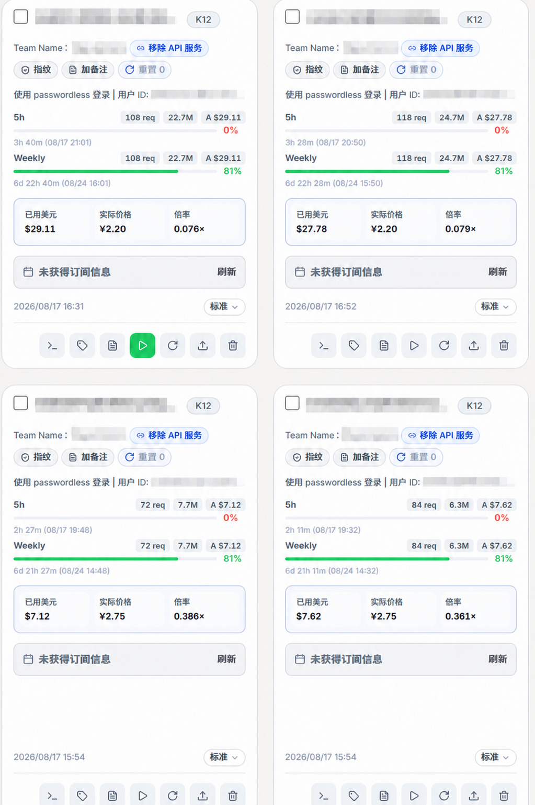
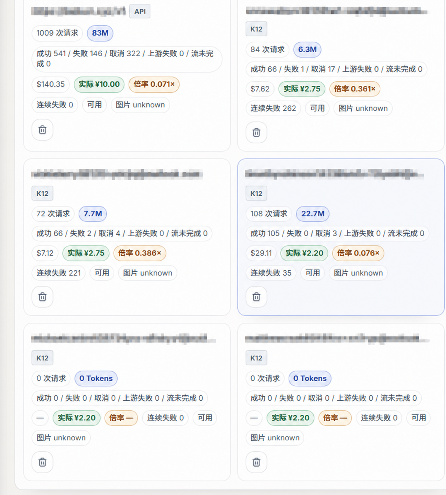

# v1.3.23-patch.1

这是基于 Cockpit Tools `v1.3.23` 的非官方 Codex API 增强版，面向 Windows x64。

## 本次改动

- `gpt-image-2` 图片生成/编辑能力识别和可操作提示。
- 429、缺少 `Retry-After`、`Retry-After: 0` 快速重试；多账号自动轮转，单账号按配置重试。
- `quota_low_first` 低额度优先调度。
- 实际价格同时写入加密账号详情与独立计费映射；覆盖安装、刷新、迁移后按账号 ID 自动恢复，不必每次升级重新填写。
- 网格、紧凑、列表三种账号布局均显示实际价格；API 服务页展示已用美元、实际价格和倍率。
- Sidecar 父进程租约、热交接和失败恢复；维护更新器额外检测 WebView2 localhost 拒绝连接页并自动回滚。
- 不强制暴露 WM 实验模型。

完整的图片与文字说明见 [`docs/FEATURE_GUIDE.zh-CN.md`](docs/FEATURE_GUIDE.zh-CN.md)。

## 图文预览

实际价格、额度与倍率（邮箱、团队名、用户 ID 和接口地址均已打马赛克）：

## Windows 下载

文件：`Cockpit.Tools_1.3.23_x64-setup.exe`

这是 Windows 安装程序，不是压缩包。下载后直接双击安装；完整步骤见[中文使用说明](docs/USAGE.zh-CN.md)。

SHA256 以 Release 附件 `SHA256SUMS.txt` 为准。安装包未进行代码签名，Windows SmartScreen 可能显示“未知发布者”；请先核对来源和 SHA256。图片权限、账号额度和上游限流仍由上游服务决定，本补丁不会绕过这些限制。

## 已验证

- 当前增强版实际启动，WebView2 页面可读且无 localhost 错误页。
- 主程序与 Sidecar 正常运行，`/v1/models` 返回 HTTP 200。
- `gpt-image-2` 可见，WM 模型未被强制暴露。
- 三笔已保存价格在账号界面恢复并显示。
- `npm run typecheck`、`npm run build`、Rust `cargo check` 和计费持久化单元测试通过。
